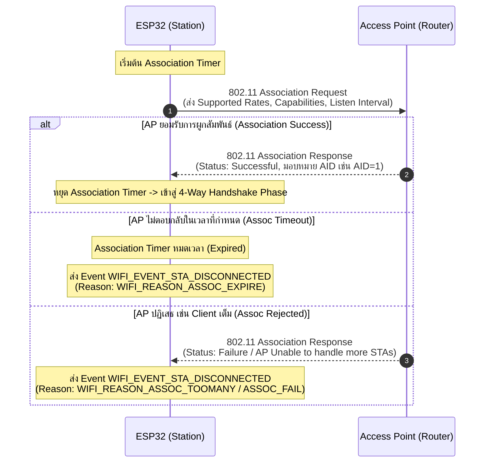

# เฟสย่อยที่ 3: Association Phase (การผูกสัมพันธ์และการตกลงคุณสมบัติ)

เมื่อ ESP32 ผ่านขั้นตอน Authentication ในระดับ Link Layer เรียบร้อยแล้ว จะเข้าสู่ **Association Phase** ซึ่งเป็นกระบวนการที่ ESP32 ส่งคำร้องขอจดทะเบียนผูกสัมพันธ์กับ Access Point (AP) เพื่อตกลงคุณสมบัติและพารามิเตอร์ของเครือข่าย เช่น อัตราการรับส่งข้อมูลที่รองรับ (Supported Data Rates), ประเภทการเข้ารหัส, และรับหมายเลขประจำตัว **Association ID (AID)** จาก AP

---

## 1. ลำดับการแลกเปลี่ยนแพ็กเกจ Association (Sequence Diagram)

---

## 2. รายละเอียดขั้นตอนทางเทคนิค (Step Breakdown)

* **s3.1**: ในขั้นนี้ ESP32 จะเริ่มต้นส่งแพ็กเกจ **Association Request** ไปยัง AP พร้อมเปิดใช้งาน **Association Timer** เพื่อรอคอยคำตอบรับ
* **s3.2 (กรณีหมดเวลา)**: หากเลยกำหนดเวลาของ Association Timer แล้ว แต่ยังไม่ได้รับการตอบกลับจาก AP:
  * ไดรเวอร์จะปล่อย Event ชื่อ **`WIFI_EVENT_STA_DISCONNECTED`**
  * ไดรเวอร์จะแจ้ง Result Code ออกมาเป็น: **`WIFI_REASON_ASSOC_EXPIRE`** (Value 4)
* **s3.3 (กรณีสำเร็จ)**: หากได้รับแพ็กเกจ **Association Response** ที่ระบุสถานะสำเร็จจาก AP:
  * **Association Timer จะหยุดทำงาน**
  * ESP32 จะได้รับ **Association ID (AID)** จาก AP และเตรียมพร้อมเข้าสู่กระบวนการสร้าง Encryption Keys ในเฟสถัดไป
* **s3.4 (กรณีถูกปฏิเสธ)**: หาก AP ตอบปฏิเสธแพ็กเกจ Association Response (เช่น AP มีจำนวน Client เชื่อมต่อเต็มขีดจำกัดแล้ว หรือไม่รองรับ Rate ที่ ESP32 ร้องขอ):
  * ไดรเวอร์จะปล่อย Event ชื่อ **`WIFI_EVENT_STA_DISCONNECTED`**
  * ไดรเวอร์จะแจ้ง Result Code ออกมาเป็น: **`WIFI_REASON_ASSOC_FAIL`** (Value 3) หรือ **`WIFI_REASON_ASSOC_TOOMANY`** (Value 17)

---

## 3. ตารางสรุป Result Code ใน Association Phase

| Reason Code Constant | รหัสตัวเลข | สื่อความหมายถึง | สาเหตุที่อาจเกิดขึ้นในทางปฏิบัติ |
| :--- | :--- | :--- | :--- |
| `WIFI_REASON_ASSOC_FAIL` | 3 | AP ปฏิเสธการผูกสัมพันธ์ | คุณสมบัติเครือข่ายไม่ตรงกัน (Capability Mismatch) |
| `WIFI_REASON_ASSOC_EXPIRE` | 4 | หมดเวลาการรอคำตอบ Association | สัญญาณรบกวนสูง แพ็กเกจตกหล่น |
| `WIFI_REASON_ASSOC_TOOMANY` | 17 | AP ไม่สามารถรับ Client เพิ่มได้อีก | อุปกรณ์ที่ต่อ Router เต็มจำนวนที่กำหนดไว้ (Max STA Exceeded) |

---

## 4. คำถามทบทวนความเข้าใจ (Checkpoints)

1. **Association ID (AID)** คืออะไร และมีประโยชน์อย่างไรต่อ Access Point ในการจัดการอุปกรณ์ไร้สาย?
~~~
คือ: หมายเลขประจำตัวชั่วคราว (ID) ที่ Access Point (AP) ออกให้กับอุปกรณ์ไร้สายแต่ละเครื่องเมื่อเชื่อมต่อสำเร็จ
ประโยชน์ต่อ AP
 - ใช้ระบุตัวตนและอ้างอิงอุปกรณ์แต่ละเครื่องได้อย่างรวดเร็ว
 - ช่วยจัดการการส่งข้อมูล และควบคุมโหมดประหยัดพลังงาน (Power Save Mode)
โดย AP จะใช้ AID ในการแจ้งเตือนว่ามีข้อมูลรอนำส่งไปยังอุปกรณ์เครื่องนั้นๆ อยู่หรือไม่
~~~
2. หาก Router รองรับอุปกรณ์ได้สูงสุด 32 เครื่อง และ ESP32 เป็นเครื่องที่ 33 พยายามจะเชื่อมต่อ จะเกิดเหตุการณ์ใดขึ้นใน Association Phase?
~~~
ESP32 จะส่ง Association Request ไปขอเชื่อมต่อ ซึ่ง Router จะปฏิเสธการเชื่อมต่อ
กลับมาด้วย Association Response ที่มีสถานะล้มเหลว เพราะทรัพยากร/AID เต็ม
 (Unable to handle additional associated stations) ทำให้การเชื่อมต่อล้มเหลว
และ ESP32 จะได้รับ Event ตัดการเชื่อมต่อพร้อม Reason Code (เช่น WIFI_REASON_ASSOC_FAIL หรือ Code 203)
~~~
